# Homingo — High-Level & Low-Level Design (HLD/LLD Supplement)

**Companion to:** Homingo_SRS.md (v1.0)
**Scope of this document:** Assignment Engine, Booking Engine internals, Event Architecture, Database Design, Cache Design, Observability, Security, Deployment, API Standards, State Machines, Sequence Diagrams, Scalability Targets, Failure Scenarios.

This document takes the SRS's functional requirements and specifies **how the backend actually implements them** — algorithms, transaction boundaries, infra topology, and degradation behavior.

---

## 1. Assignment Engine

### 1.1 Goal
Given a booking request (service, location, slot), select the best available Professional from the eligible pool.

### 1.2 Eligibility Filter (hard filters, applied first)
A Professional is only a *candidate* if ALL of the following hold:
1. `kyc_status = APPROVED` and the specific service category is `ACTIVE`
2. Currently `ONLINE`/`AVAILABLE` (not already assigned to an overlapping slot)
3. Serves the customer's pincode/geo-zone
4. Not `BLACKLISTED` for this customer (see 1.7) and not on `COOLDOWN` (see 1.8)
5. Below their configured max daily/concurrent job cap

### 1.3 Scoring Model (soft ranking, applied to eligible candidates)
Each candidate gets a weighted composite score:

```
score = (w1 * proximity_score)
      + (w2 * rating_score)
      + (w3 * availability_score)      // least-busy
      + (w4 * reliability_score)       // 1 - cancellation_rate
      + (w5 * acceptance_speed_score)  // historical avg accept latency
```

Default weights (tunable via Admin config, per category if needed):
| Factor | Weight | Notes |
|---|---|---|
| Proximity (ETA) | 0.35 | Lower travel time = higher score. Computed via haversine distance as a v1 proxy, upgraded to Maps Distance Matrix API for real travel-time in v2. |
| Rating | 0.25 | Normalized 0–1 from `overall_rating` (min. sample size threshold to avoid new-professional bias skew — use Bayesian-averaged rating, not raw average). |
| Least-busy | 0.20 | `1 - (jobs_today / max_daily_capacity)` — spreads load, avoids overloading top performers. |
| Reliability (cancellation rate) | 0.15 | `1 - rolling_30day_cancellation_rate`. Professionals below a floor threshold (e.g., >20% cancellation) are hard-filtered out entirely, not just down-ranked. |
| Acceptance speed | 0.05 | Rewards professionals who historically accept fast — improves overall SLA. |

Top-N (e.g., top 3) candidates are offered in sequence (not broadcast to all — reduces spam and decision fatigue), unless the category is configured for **broadcast mode** in low-supply zones.

### 1.4 Surge/Demand Balancing
- Redis-backed real-time counters per `zone_id + category_id + time_bucket`: `active_bookings`, `available_professionals`.
- Demand/supply ratio above a configurable threshold triggers:
  - Price surge multiplier (feeds Pricing Engine, not Assignment Engine directly)
  - Widened search radius for that zone
  - Priority nudge to nearby idle professionals via push notification ("high demand near you")

### 1.5 Travel Estimation
- v1: Haversine straight-line distance × a road-network correction factor (e.g., ×1.3) as a cheap approximation.
- v2: Integrate a real routing/distance-matrix API, cached per `(origin_h3_cell, dest_h3_cell)` pair for a short TTL to control API cost.
- Geo-indexing: Professionals' live location stored in **Redis Geo** (`GEOADD`/`GEORADIUS`) for O(log N) nearest-neighbor queries instead of scanning Postgres.

### 1.6 Retry, Timeout & Fallback Logic
```
1. Rank eligible candidates → offer to candidate #1
2. Start a per-offer timeout timer (e.g., 90 seconds)
3. On ACCEPT  → lock booking to this professional, cancel remaining offer timers
   On REJECT  → immediately move to candidate #2
   On TIMEOUT → treat as implicit reject, apply a small reliability-score penalty, move to candidate #2
4. Repeat up to max_attempts (e.g., 5 candidates)
5. If all attempts exhausted:
     → widen radius by step (e.g., +2km) and retry the ranking pass once
     → if still no acceptance → escalate to FALLBACK state:
         - Notify Admin ops queue ("unassigned booking")
         - Notify Customer: offer to wait (keep searching in background) or cancel with full refund
6. Hard ceiling: if unassigned after N minutes (configurable), auto-cancel + full refund + incident log
```
- All offer/accept/reject events are recorded (`assignment_attempts` table) for both auditability and future ML-based ranking improvements.

### 1.7 Blacklist
- Two levels:
  - **Customer-specific blacklist**: a Customer can block a specific Professional from ever being assigned to them again (assignment engine filters them out silently).
  - **Platform-wide blacklist**: Admin-driven (fraud/safety ban) — professional excluded from all assignment pools; distinct from KYC-suspension (see SRS §4.1) but implemented via the same `professional_profiles.status` check.

### 1.8 Cooldown
- A Professional who **rejects** or **times out** on an offer gets a short cooldown (e.g., 3–5 minutes) before being eligible for a *new offer for a different booking*, to prevent rapid repeated no-responses from degrading the whole queue. This is a throttle, not a punishment — distinct from the reliability-score penalty.
- A Professional who **cancels after acceptance** gets a longer cooldown + counts toward their rolling cancellation-rate metric (which feeds the reliability score and, past a threshold, the hard filter).

---

## 2. Booking Engine — Transactional Design

### 2.1 Booking Transaction Flow (happy path)
```
1. Customer selects service + slot
2. API: POST /bookings
   a. Redis: SET slot_lock:{professional_zone}:{slot} NX PX 600000   (soft lock, 10 min TTL)
      - if lock fails → "slot no longer available"
   b. Postgres transaction BEGIN
        - INSERT booking (status = CREATED)
        - INSERT booking_status_history
      COMMIT
   c. Call Payment Gateway → create payment intent, return client secret
   d. Booking status → PAYMENT_PENDING
3. Client confirms payment → gateway webhook (source of truth, not client callback)
4. Webhook handler (idempotent, see 2.4):
   Postgres transaction BEGIN
     - UPDATE booking SET status = CONFIRMED
     - INSERT payment record (status = SUCCESS)
     - INSERT wallet_ledger placeholder (pending, not yet earned)
   COMMIT
   → Redis: DEL slot_lock (converted to a hard booking now; real slot occupancy governed by DB, not the temp lock)
5. Enqueue assignment job (BullMQ) → Assignment Engine (§1) runs asynchronously
6. On acceptance: Postgres transaction updates booking.professional_id + status = PROFESSIONAL_ASSIGNED
7. Subsequent status transitions (EN_ROUTE → ... → COMPLETED) are single-row updates + history insert, each wrapped in its own short transaction — no long-held locks.
```

### 2.2 Redis Locking Rules
- Locks are **advisory soft locks** for UX (preventing two customers from checking out the same slot simultaneously) — they are NOT the system of record.
- The system of record for "is this slot actually taken" is always the Postgres `bookings` table with a **unique constraint** on `(professional_id, slot_start_time)` for active statuses (see §4.3) — this is the real double-booking guard; Redis lock is just an early, fast UX rejection.
- Lock key pattern: `lock:slot:{professional_id}:{slot_start_epoch}`, TTL slightly longer than expected checkout time; auto-expires if the customer abandons checkout (no manual cleanup needed).

### 2.3 PostgreSQL Transaction Boundaries
- **Rule of thumb:** one transaction = one state transition + its directly dependent writes (history row, ledger row). Never hold a transaction open across an external API call (payment gateway, SMS, push notification) — those happen *outside* the transaction, triggered after commit, via outbox/queue (see §3).
- Isolation level: `READ COMMITTED` for most operations; `SERIALIZABLE` only for the specific booking-creation path where the unique-slot constraint plus a `SELECT ... FOR UPDATE` on the professional's availability row prevents race conditions under concurrent load.

### 2.4 Idempotency
- Every client-initiated mutating request (`POST /bookings`, `POST /payments/confirm`, `PATCH /jobs/:id/status`) requires an `Idempotency-Key` header.
- Server stores `(idempotency_key, request_hash, response_snapshot)` in a short-lived table/Redis; a repeated request with the same key returns the cached response instead of re-executing (protects against double-submits from flaky mobile networks, double-tap, retry storms).
- Payment webhooks are idempotent by `gateway_event_id` — duplicate webhook deliveries (gateways retry on non-2xx) are detected and no-op'd.

### 2.5 Retry Behavior
- Client-side: exponential backoff with jitter for transient network failures (429/503).
- Server-side background jobs (BullMQ): configurable retry count per job type (e.g., payout jobs: 5 retries with exponential backoff; notification jobs: 3 retries then dead-letter).
- Dead-letter queue (DLQ) for jobs that exhaust retries → Admin-visible alert, manual intervention path.

### 2.6 Compensation (Saga Pattern for cross-system consistency)
Because booking → payment → assignment → notification spans multiple systems, Homingo uses a **choreography-based saga**:
- If payment succeeds but booking-confirmation write fails → compensating action: auto-refund job triggered, booking marked `FAILED_REFUNDED`.
- If assignment fails after payment (no professional found) → compensating action: auto-refund + booking `CANCELLED_NO_PROFESSIONAL`.
- If payout is clawed back after a late dispute (SRS §4.4) → compensating ledger reversal entry (never a silent balance mutation).
- Every compensating action is itself an auditable, idempotent operation — not an ad-hoc fix.

### 2.7 Failure Recovery
- **Reconciliation jobs** (scheduled, e.g., every 5 min): scan for bookings stuck in `PAYMENT_PENDING` beyond a threshold with no webhook received → actively poll gateway status → resolve or auto-cancel+release lock.
- **Orphan detection**: payments with no matching booking (crash between steps) → auto-refund job.
- **Stuck-in-progress detection**: bookings stuck in `IN_PROGRESS` far beyond expected service duration → flagged for Admin/ops follow-up (possible app crash on professional's side).

---

## 3. Event Architecture

### 3.1 Why event-driven
Booking, payment, notification, payout, and analytics concerns are decoupled so that (a) slow/non-critical work (SMS, push, analytics) never blocks the critical path (payment/booking confirmation), and (b) new consumers (e.g., a future fraud-detection service) can subscribe without touching core booking code.

### 3.2 Backbone
- **v1 (pragmatic):** Redis Streams + BullMQ — sufficient at moderate scale, already in the stack, low operational overhead.
- **v2 (at scale):** Kafka — once event volume/replay/multi-consumer-group needs grow beyond what Redis Streams comfortably handles (see §13 scalability targets for the trigger point).
- Pattern: **transactional outbox** — the service writes its state change + an `outbox_events` row in the *same* Postgres transaction, and a separate relay process publishes from the outbox to the stream. This avoids the classic "DB committed but event publish failed" inconsistency.

### 3.3 Core Domain Events
| Event | Producer | Key Consumers |
|---|---|---|
| `booking.created` | Booking Engine | Analytics, Admin dashboard |
| `booking.confirmed` | Payment webhook handler | Assignment Engine, Notification service |
| `booking.professional_assigned` | Assignment Engine | Notification service, Customer app (real-time) |
| `booking.status_changed` | Booking Engine | Notification service, Analytics, Customer live-tracking |
| `booking.cancelled` | Booking Engine / Admin | Refund service, Notification service, Assignment Engine (release slot) |
| `payment.succeeded` / `payment.failed` | Payment webhook handler | Booking Engine, Wallet ledger, Notification |
| `payout.completed` / `payout.failed` | Payout job | Professional wallet, Notification |
| `kyc.status_changed` | KYC service | Professional profile, Notification, Assignment Engine (activate/deactivate) |
| `dispute.raised` / `dispute.resolved` | Dispute service | Wallet ledger (hold/release), Notification, Analytics |
| `professional.suspended` | Admin service | Assignment Engine (remove from pool), Booking Engine (trigger reassignment workflow per SRS §4.1) |

### 3.4 Consumer Guarantees
- At-least-once delivery assumed; all consumers **must** be idempotent (use event `id` for dedupe).
- Consumer groups per concern (notifications, analytics, ledger) so one slow consumer doesn't block others.

---

## 4. Database Design

### 4.1 ER Diagram (core relationships)

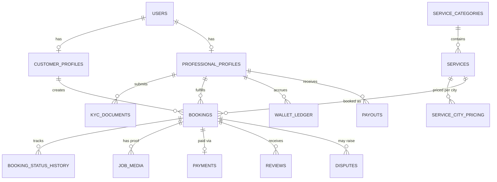

### 4.2 Indexing Strategy
| Table | Index | Purpose |
|---|---|---|
| `bookings` | `(customer_id, created_at DESC)` | Customer booking history |
| `bookings` | `(professional_id, slot_start_time)` | Professional calendar lookups |
| `bookings` | `(status, slot_start_time)` WHERE status IN (active) | Ops queue / SLA monitoring |
| `professional_profiles` | GIN index on `active_categories[]` | Category-based candidate search |
| `kyc_documents` | `(professional_id, doc_type, status)` | KYC review queue |
| `wallet_ledger` | `(professional_id, created_at DESC)` | Wallet statement queries |
| `job_media` | `(booking_id, type)` | Fetching before/after sets |
| `notifications` | `(user_id, read_at)` | Unread-notification counts |

### 4.3 Unique Constraints (data-integrity guardrails)
- `bookings`: partial unique index on `(professional_id, slot_start_time)` for statuses NOT IN `(CANCELLED_*, FAILED_REFUNDED)` — the real double-booking guard (§2.2).
- `payments`: unique on `gateway_ref` — prevents duplicate payment record creation from webhook retries.
- `kyc_documents`: unique on `(professional_id, category_id, doc_type)` for the currently-active submission (older ones archived, not deleted).
- `idempotency_keys`: unique on `(key, endpoint)`.

### 4.4 Partition Strategy
- `bookings` and `booking_status_history` partitioned by **month** (range partition on `created_at`) once volume grows — keeps hot (recent) data fast to query, cold data cheap to archive.
- `wallet_ledger` partitioned similarly — financial history grows unbounded and is append-only, a natural partitioning candidate.
- `notifications` partitioned by month with an aggressive auto-drop policy (e.g., 90 days) since it's low-value historical data.

### 4.5 Sharding Plan (future / post-product-market-fit)
- Not needed at launch (single-region Postgres with a read replica is sufficient — see §13 targets).
- If sharding becomes necessary: shard by **city_id / geo-zone**, since almost all query patterns (search, assignment, booking) are naturally zone-scoped. `users`/`payments` stay in a global (or geo-primary) store since a customer's identity/payment history should be zone-independent.

### 4.6 Archive Strategy
- Bookings older than N years (statutory retention per NFR-7 in the SRS) moved to a cold-storage table/warehouse (e.g., monthly ETL to a data-lake/BigQuery-style store) and purged from the hot operational DB — but **financial ledger entries are never purged**, only migrated to cheaper storage, per audit requirements.
- Job-proof images: original stays in object storage; DB only ever holds metadata + URL, so archival is a storage-tier lifecycle policy (e.g., move to cold storage tier after 12 months), not a DB operation.

---

## 5. Cache Design (Redis)

| Cached Data | TTL | Invalidation Trigger | Fallback | Ownership |
|---|---|---|---|---|
| `service_categories`, `services` (catalog) | 1 hour | Admin edits category/service → explicit cache-bust event | Read-through from Postgres on miss | Catalog service |
| City/pincode pricing | 30 min | Admin price change → explicit invalidation | Read-through from Postgres | Catalog service |
| Professional availability/live-location (Geo) | Real-time (no TTL on geo-set; heartbeat refresh every 15–30s) | Professional goes offline → explicit `GEODEL` | Treat missing = offline/unavailable | Assignment service |
| Slot soft-locks | 10 min hard TTL | Auto-expire; explicit delete on booking confirm/abandon | N/A — absence just means "not locked" | Booking service |
| OTP codes (login + job-completion OTP) | 5 min | Auto-expire; explicit delete on successful verify | Re-request OTP | Auth service |
| JWT blacklist (revoked refresh tokens / logged-out sessions) | Matches token's remaining TTL | Explicit add on logout/refresh-rotation/security event | Absence = token still valid (checked against blacklist only) | Auth service |
| Rate-limit counters (per IP/user, e.g., OTP requests) | Sliding window (e.g., 1 min/1 hour buckets) | Auto-expire | Fail-open with conservative default vs fail-closed — **fail-closed** for OTP/auth endpoints (safer to block briefly than allow abuse) | Auth/Gateway |
| Assignment scoring inputs (professional rating, cancellation rate snapshots) | 10 min | Recomputed async on new review/cancellation event | Read-through from Postgres (slightly stale acceptable) | Assignment service |
| Session/auth context (lightweight user claims) | Matches access-token TTL (~15 min) | N/A, self-expiring | Re-derive from JWT verification | Auth service |

**General rules:**
- Cache-aside pattern (app reads cache → miss → reads DB → populates cache) for catalog/pricing data — simple and sufficient.
- Write-through **not** used for money-related data — payments/wallet/ledger are never cached; always read from Postgres (correctness > latency there).
- Every cache key has a clearly designated **owning service** — no cross-service writes to another service's cache namespace (prevents silent invalidation bugs).

---

## 6. Observability

- **Structured logging:** JSON logs (pino, since Fastify pairs natively with it) with mandatory fields: `timestamp`, `level`, `service`, `request_id`, `user_id` (if applicable), `booking_id` (if applicable).
- **Request IDs:** generated at API-gateway/edge, propagated through every downstream call (HTTP header + passed into queue job payloads) so a single customer action is traceable end-to-end across sync + async hops.
- **Distributed tracing:** OpenTelemetry SDK instrumented in Fastify + BullMQ workers + Postgres client, exported to a tracing backend (e.g., Jaeger/Tempo) — critical for diagnosing "why did this booking take 4 seconds to confirm."
- **Metrics:** Prometheus client exposing:
  - Business metrics: bookings/min, confirmation rate, assignment success rate, avg time-to-assign, cancellation rate, payout failure rate.
  - System metrics: request latency histograms (p50/p95/p99), error rate by endpoint, queue depth/lag per BullMQ queue, DB connection pool utilization, Redis hit/miss ratio.
- **Dashboards:** Grafana, pre-built boards for: booking funnel, assignment engine health, payment success/failure trend, queue backlogs, infra health.
- **Health endpoints:** `/healthz` (liveness — process is up) and `/readyz` (readiness — DB/Redis/queue reachable) per service, used by the load balancer/orchestrator.
- **Alerting:** Threshold + anomaly alerts routed to on-call (e.g., PagerDuty/Opsgenie) for: payment success rate drop, assignment success rate drop, queue backlog beyond threshold, error rate spike, DB replica lag beyond threshold.
- **Error tracking:** Sentry (or equivalent) capturing unhandled exceptions with request context, grouped by release version for regression detection.
- **Audit logs:** distinct from operational logs — immutable, queryable record of *who did what* (Admin actions, KYC decisions, refunds, suspensions) per SRS FR-10.8, stored separately with stricter retention/access control.

---

## 7. Security (deep dive)

| Concern | Control |
|---|---|
| Token replay | Refresh tokens are **single-use and rotated** on every refresh; old token is immediately invalidated (stored hash marked `used`) — reuse of a rotated token triggers a security event (possible token theft) and force-logs-out the whole session family. |
| OTP abuse | Rate limit per phone number (e.g., 5 requests/hour) and per IP; exponential backoff on repeated failed verification attempts; CAPTCHA/device-attestation challenge triggered after N failures. |
| WAF / API Gateway | Fronting load balancer runs a managed WAF (common rule sets: SQLi, XSS, known bad bot signatures) before traffic reaches Fastify instances; API Gateway layer also enforces coarse rate limiting and API-key/JWT validation before hitting business logic. |
| SQL injection | Parameterized queries only (via query builder/ORM — never raw string concatenation); enforced via lint rule + code review checklist. |
| XSS | Relevant mainly to the Admin dashboard (server-rendered/React) — output encoding by default, CSP headers, no `dangerouslySetInnerHTML` on user-supplied content (e.g., review text, dispute notes). |
| SSRF | Any backend feature that fetches a user-supplied URL (e.g., future webhook configs) validated against an allowlist and blocked from hitting internal/private IP ranges. |
| Malware scanning | All uploaded files (KYC docs, job-proof images) scanned by an antivirus/malware-scan step in the upload pipeline before being marked "available," to prevent the storage bucket becoming a malware distribution vector. |
| KYC encryption | Documents encrypted at rest (bucket-level KMS encryption at minimum; field-level encryption for extracted PII like ID numbers in Postgres); access to raw documents requires a signed, short-lived URL generated per authorized view, and every view is audit-logged. |
| Secrets management | No secrets in code/env files committed to git; managed via a secrets manager (e.g., AWS Secrets Manager/Vault), injected at runtime, rotated periodically, scoped per service (principle of least privilege). |
| RBAC permissions matrix | Fine-grained permissions beyond role names — e.g., `support_admin` can view disputes but not approve payouts; `ops_admin` can approve KYC but not modify commission rates; enforced via a permissions table checked at the API layer, not just UI hiding. |

---

## 8. Deployment Architecture

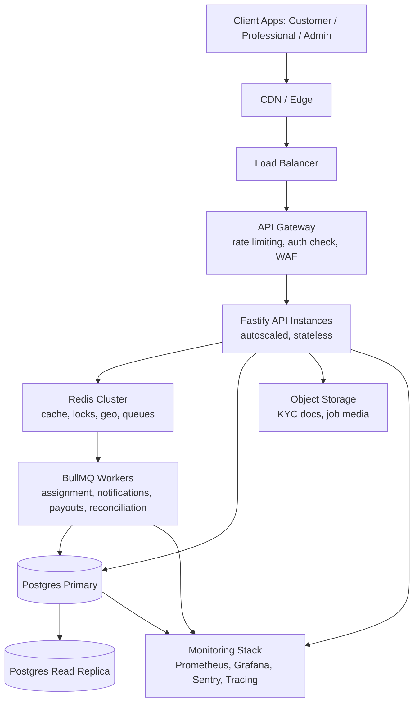

### 8.1 Environments
- `local` (docker-compose: Postgres, Redis, mock payment/SMS providers)
- `staging` (mirrors prod topology at smaller scale, uses sandbox/test payment gateway keys)
- `production`

### 8.2 CI/CD
- Git-based pipeline: PR → lint + typecheck + unit tests + integration tests (against ephemeral DB) → build container image → deploy to staging automatically → manual approval gate → deploy to production.
- Database migrations run as a **separate, reviewed step** before app deploy (never auto-applied by app boot) — backward-compatible migrations only (expand-then-contract pattern) to support zero-downtime deploys.

### 8.3 Rollback
- Container images are immutable and versioned; rollback = redeploy previous known-good image tag.
- DB migrations designed to be additive/non-breaking so a code rollback doesn't require a matching DB rollback in the common case; destructive migrations (column drops) only shipped after the old code path has been fully retired.

### 8.4 Zero Downtime
- Rolling deploys behind the load balancer (new instances health-checked via `/readyz` before old ones are drained).
- Long-running BullMQ jobs designed to be resumable/idempotent so an in-flight worker restart doesn't lose or duplicate work.

### 8.5 Autoscaling
- API layer: horizontal autoscaling on CPU + request-latency signals (stateless by design — session state lives in JWT + Redis, not in-process).
- Worker layer: autoscaling on **queue depth** per queue (e.g., scale up notification workers when the notification queue backlog crosses a threshold), independent from API scaling.

---

## 9. API Standards

| Concern | Convention |
|---|---|
| Versioning | URI-based: `/v1/...`; breaking changes ship as `/v2/...` with a deprecation window for `/v1/`, never silently mutated in place. |
| Pagination | Cursor-based (`?cursor=...&limit=...`) for high-volume lists (bookings, ledger) to avoid offset-pagination performance decay; offset pagination acceptable for small, bounded admin lists. |
| Filtering | Consistent query-param convention: `?status=CONFIRMED&city=indore&from=...&to=...`. |
| Sorting | `?sort=created_at:desc` convention, whitelisted sortable fields only (prevents arbitrary/expensive sort injection). |
| Idempotency keys | Required header `Idempotency-Key` on all unsafe (POST/PATCH) mutating endpoints handling money or state transitions (§2.4). |
| Error format | Consistent envelope: `{ "error": { "code": "BOOKING_SLOT_TAKEN", "message": "...", "request_id": "..." } }` — machine-readable `code` for client logic, human `message` for display/logging. |
| Validation | Schema-based request validation at the route boundary (e.g., JSON Schema via Fastify's built-in validation) — reject malformed input before it reaches business logic; validation errors follow the same error envelope with field-level detail. |
| Rate limits | Per-endpoint-class limits (e.g., stricter on `/auth/otp/*`, looser on `/services`), enforced at the gateway layer with `429` + `Retry-After` header on breach. |

---

## 10. State Machines

### 10.1 Booking
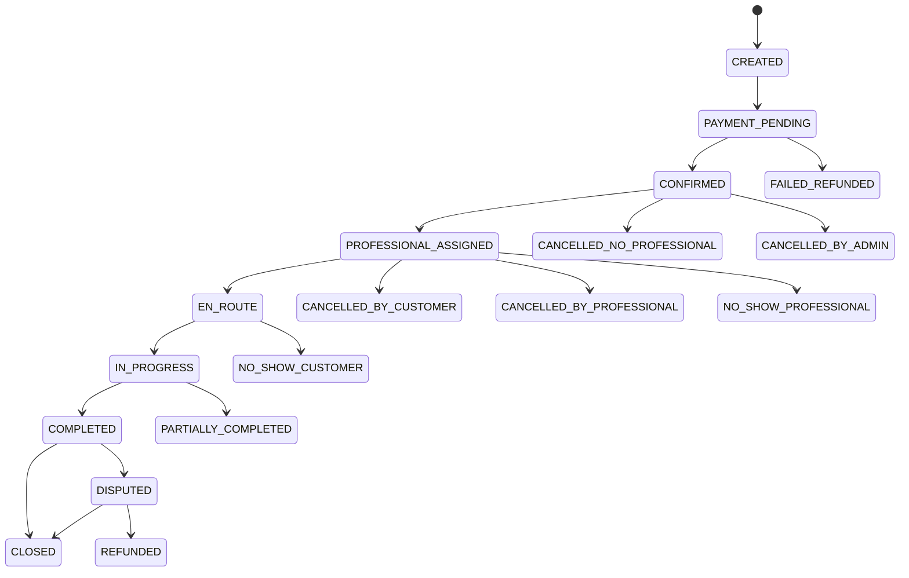

### 10.2 KYC
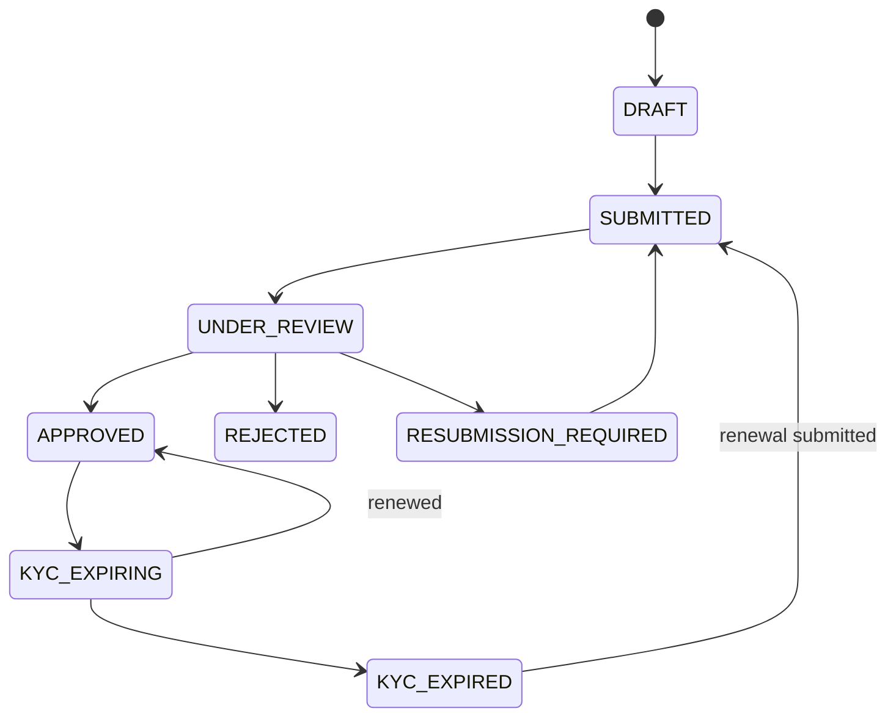

### 10.3 Payment
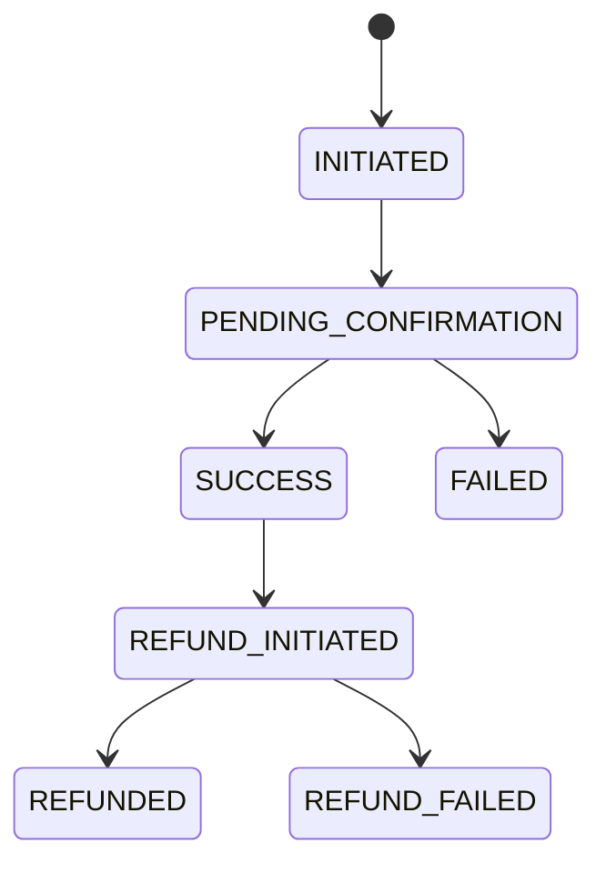

### 10.4 Refund
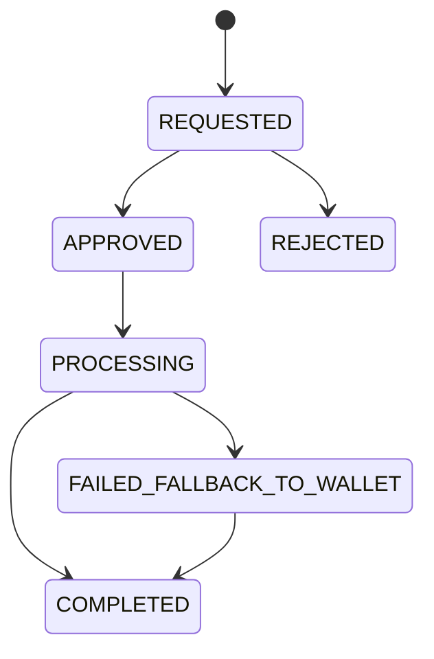

### 10.5 Professional (account status)
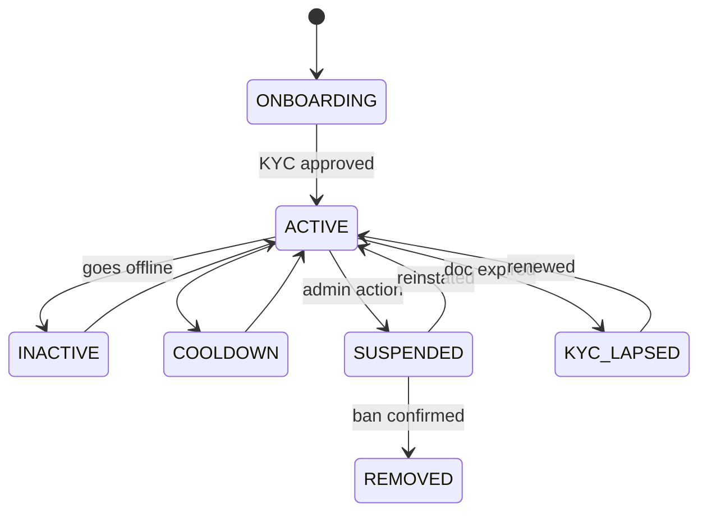

### 10.6 Payout
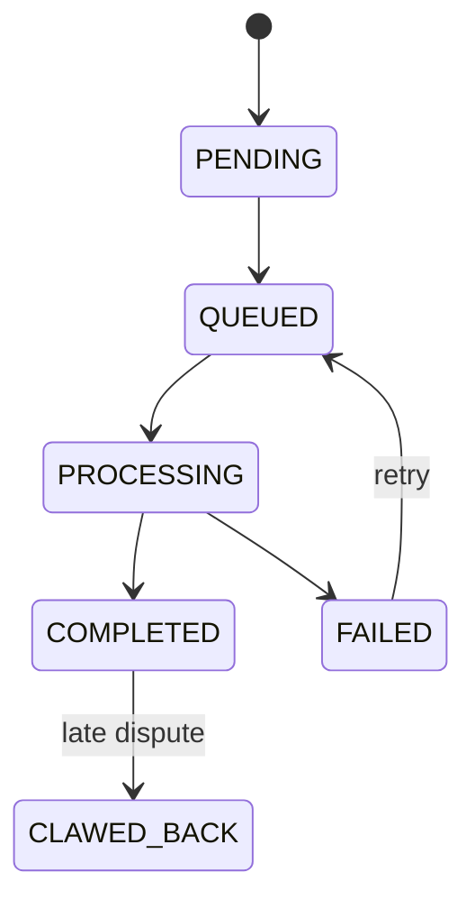

### 10.7 Dispute
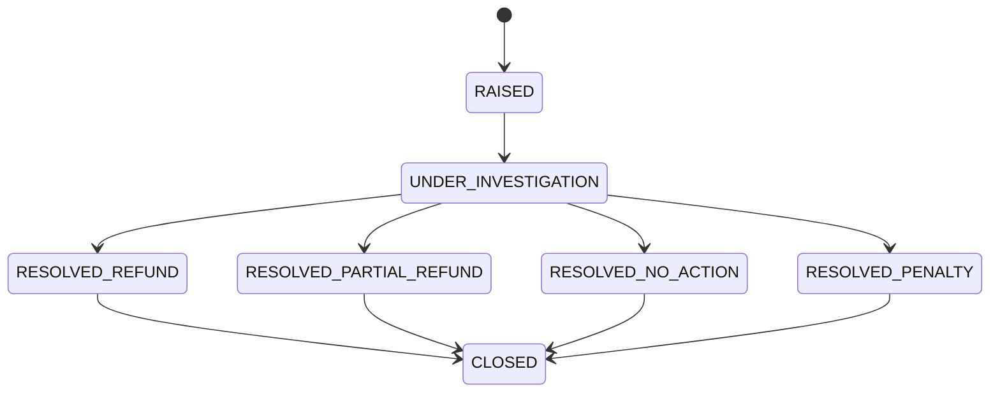

---

## 11. Sequence Diagrams

### 11.1 Customer Booking Flow
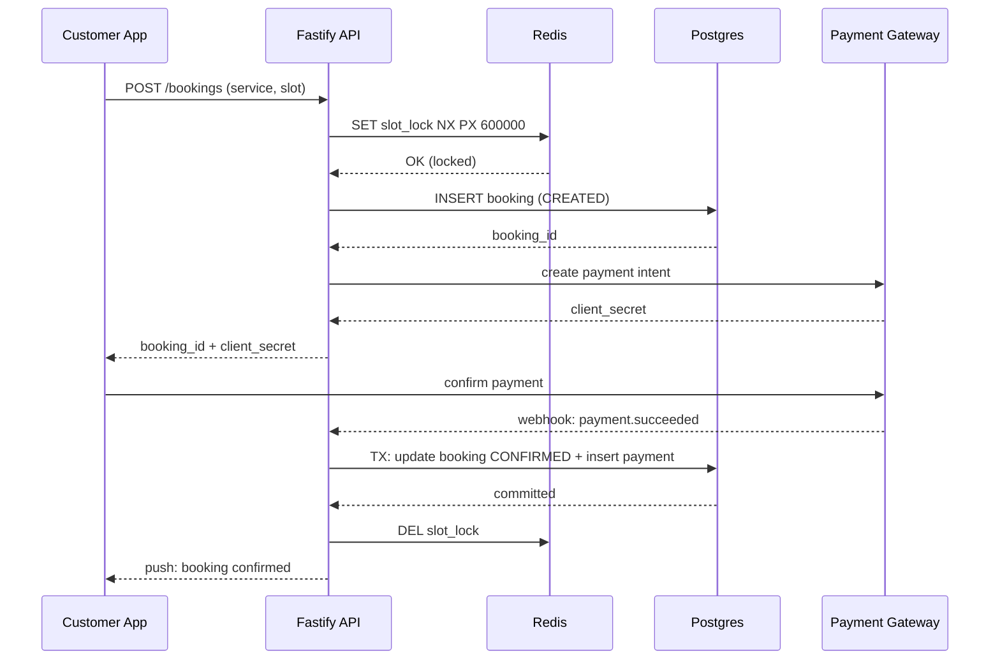

### 11.2 Auto-Assignment
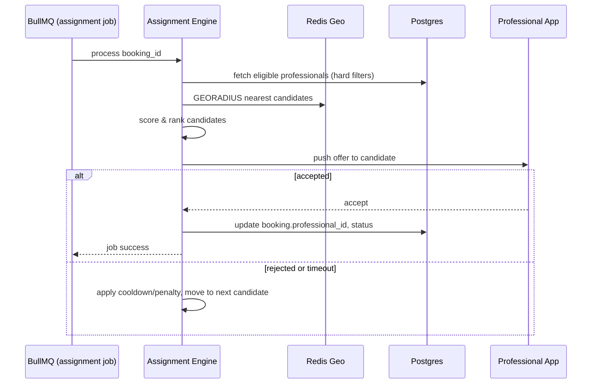

### 11.3 Payment Webhook Handling
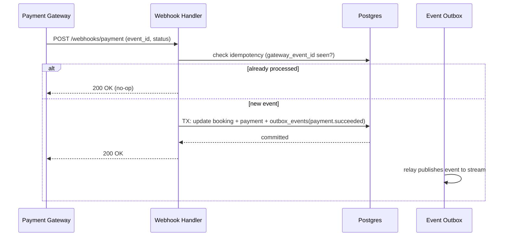

### 11.4 Refund
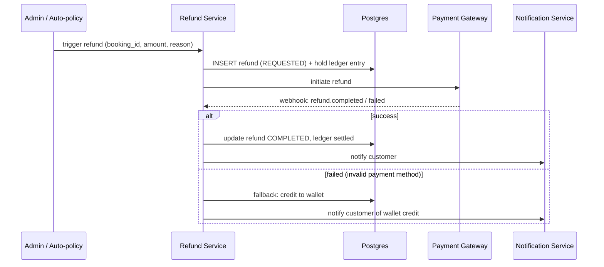

### 11.5 KYC Approval
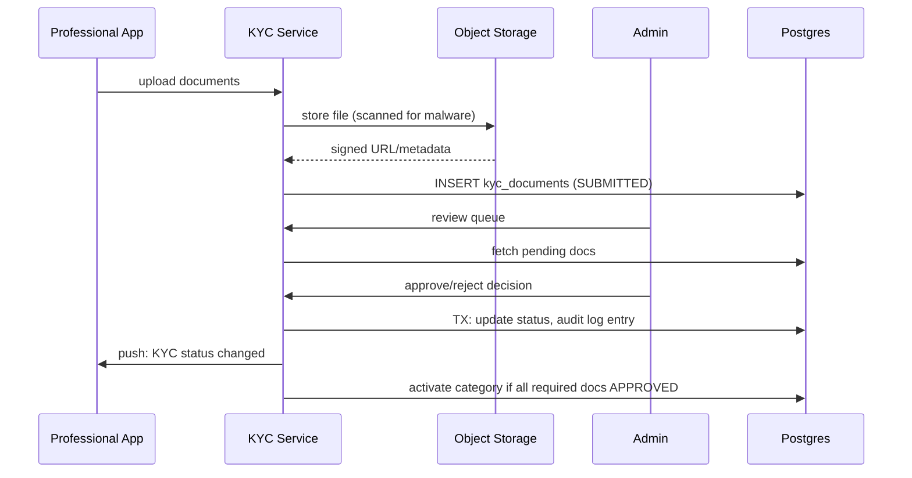

### 11.6 Professional Suspension
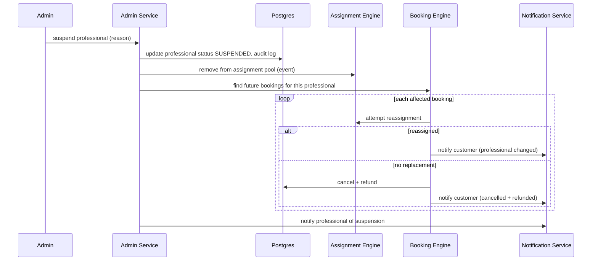

### 11.7 Wallet Settlement
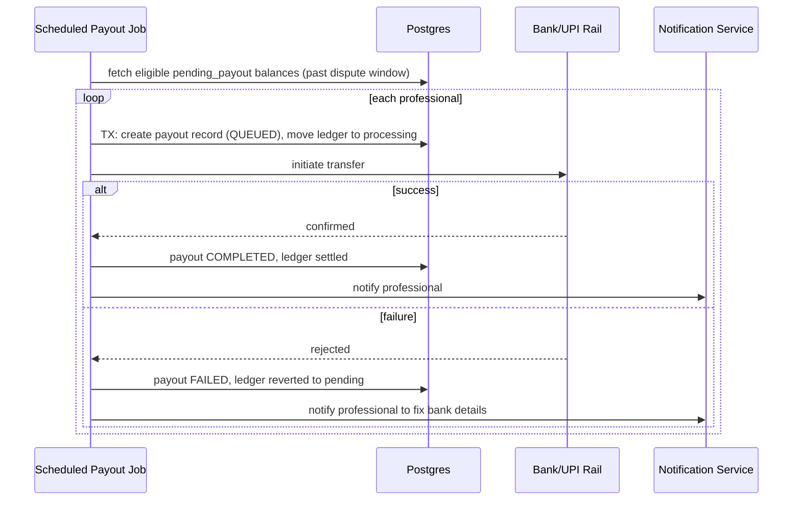

---

## 12. Scalability Targets

| Metric | Target (v1 launch) | Target (growth phase) |
|---|---|---|
| Concurrent active users | 5,000 | 20,000 |
| Bookings/minute (peak) | 300 | 3,000 |
| API latency (P95) | < 300 ms | < 150 ms |
| API latency (P99) | < 800 ms | < 400 ms |
| Redis failover time | < 60s | < 30s |
| Registered professionals | 10,000 | 1,000,000 |
| Registered customers | 100,000 | 10,000,000 |
| Assignment decision time (offer sent) | < 5s after payment confirm | < 2s |
| Postgres replica lag (acceptable) | < 5s | < 1s |

These are **design inputs**, not vanity numbers — e.g., the "growth phase" bookings/minute figure is what determines whether Redis Streams needs to become Kafka (§3.2), and whether/when city-based sharding (§4.5) gets triggered.

---

## 13. Failure Scenarios & Degradation Behavior

| Failure | System Behavior |
|---|---|
| **Redis down** | Geo-lookup/assignment falls back to a (slower) Postgres-based nearest-neighbor query with PostGIS; slot soft-locks are skipped (rely solely on the Postgres unique constraint — slightly worse UX on race collisions but no correctness loss); rate-limiting fails closed on auth-sensitive endpoints, fails open (log-only) on low-risk endpoints. |
| **Postgres replica lag** | Read-heavy, non-critical queries (analytics, admin lists) may serve slightly stale data; anything transactional (booking confirm, payment, wallet) always reads from primary, never the lagging replica. |
| **Postgres primary down** | Full write outage for bookings/payments — system enters read-only degraded mode (customers can browse but not book) until failover to standby completes; alerting fires immediately; failover automated via managed Postgres HA where possible. |
| **Payment gateway outage** | New bookings blocked from reaching `CONFIRMED` (held at `PAYMENT_PENDING` with clear "payment provider unavailable, try again shortly" messaging); existing confirmed bookings/in-progress jobs unaffected; reconciliation job catches any late-arriving webhooks once the gateway recovers. |
| **SMS provider down** | OTP delivery falls back to a secondary SMS provider (multi-provider config) or to email/push OTP if phone verification isn't the only channel; booking-status SMS updates degrade to push-only until recovery — never blocks the booking flow itself. |
| **Object storage outage** | KYC/job-proof image uploads queued client-side and retried (per SRS §4.5 edge case) rather than failing the booking-completion flow outright; existing image URLs unaffected if only the write-path (not read-path) is impacted. |
| **BullMQ backlog** | Autoscaling adds workers (§8.5); if backlog keeps growing, lower-priority queues (analytics, non-critical notifications) are deprioritized in favor of critical queues (assignment, payment reconciliation) via queue priority levels — critical path never starves behind bulk notification sends. |
| **Kafka unavailable** (v2, once adopted) | Producers buffer locally with bounded retry; if buffer exceeds threshold, non-critical events are dropped with a metric/alert (acceptable loss for analytics-tier events) while critical events (payment, booking) still go through the transactional-outbox relay with retry-until-success, never silently dropped. |
| **Deployment rollback needed** | Handled per §8.3 — previous image redeployed; DB migrations designed additive-first so rollback doesn't require a matching down-migration in the common case. |
| **Node/instance crash mid-request** | Stateless API design means the load balancer simply routes to a healthy instance; any in-flight DB transaction rolls back automatically (Postgres ACID guarantee) — no partial-write corruption; idempotency keys (§2.4) let the client safely retry the same logical request. |
| **Region outage** (future multi-region) | Out of scope for v1 (single-region deployment); noted as a growth-phase requirement — would need active-passive DB replication across regions and a documented RTO/RPO target before being promised to customers. |

---

*This document, together with Homingo_SRS.md, forms the HLD-level engineering spec. Recommended next artifacts per your own note: LLD (detailed schema DDL + class-level API contracts), OpenAPI/Swagger spec, and an Operations Runbook — happy to generate any of those next.*
